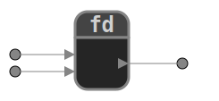

# Functions diagram

Functions-diagram is a Python program for graphically representing functions by specifying the input and output names and types.  
Its aim is to help learners take their first steps with functions and analyse how a programme works.  
Elements (nodes and functions) can be linked and connected to each other.   
The graphical representation can be exported in SVG format.  
 
<div style="text-align: center">
    <a href="https://github.com/ebuonocore/functions_diagram">
        
    </a>
</div>


## Table of contents
* [Description](#description)
  * [Example of simple diagram](#example-of-simple-diagram)
  * [Example of associated functions](#example-of-associated-functions)
  * [A more complete example](#a-more-complete-example)
* [Buttons](#buttons)
  * [Save file](readme/save_diagram.md)     
  * [Export diagram to image (.SVG)](readme/export_SVG.md)
  * [Add or edit elements](readme/add_edit_elements.md)  
* [Backup file format](#backup-file-format)
* [Author](#author)
* [Project status](#project-status)
* [Roadmap](#roadmap)
* [License](#license)

## Description
### Example of simple diagram
  

This diagram represents the call of a <code>xor</code> function:  
```{python} 
cipher_text = xor(plain_text, key)
```
We can gess that this function takes two parameters and returns a value.
### Example of associated functions  
Another example involving a second call to the <code>xor</code> function.  
  
Here is the corresponding code:
```{python} 
cipher_Text = xor(plain_text, key)
deciphered_text = xor(cipher_Text, key)
```

The same diagram with type indications and the corresponding code.  
  

```{python} 
def xor(a: int, b: int) -> int:
    """
    Return the bitwise operation xor on the two positive integers a and b.

    >>> xor(8, 7)
    15

    >>> xor(7, 3)
    4
    """
    return a ^ b

cipher_Text = xor(plain_text, key)
deciphered_text = xor(cipher_Text, key)
```

The code and diagram are consistent with the signature of the <code>xor</code> function.  
```{python} 
>>> import inspect
>>> inspect.signature(xor)
<Signature (a: int, b: int) -> int>
```

### A more complete example
The example below is based on the [mypy module](https://mypy.readthedocs.io/en/stable/getting_started.html).

## Buttons
 Create a new file  
 Open a file  
 [Save file](readme/save_diagram.md)     
 [Export diagram to image (.SVG)](readme/export_SVG.md)  
 Move function or node  
 [Add a function](readme/add_edit_elements.md#function)  
 [Add a free node](readme/add_edit_elements.md#node)    
 Connect two nodes  
 [Edit element (node or function)](readme/add_edit_elements.md)    
 Delete element (node, function or connexion)  
 Undo  
 Redo  
 Place automaticly the objects on the screen  
 Edit settings  
 Show informations  

Some operations require you to select a destination first. You can exit this mode by right-clicking or by pressing Enter or Esc.

## Author
Eric Buonocore

## Project status
The programme is operational.
- [x] Adding elements (nodes, functions)
- [x] Interconnecting elements
- [x] Opening and saving diagrams
- [x] Moving and editing elements
- [x] Undo/Redo
- [x] Automatic positioning of elements
- [x] Settings and help

## Roadmap
- [ ] Enable zooming and shifting of the whole layout
- [ ] Multi-select items to move or delete them
- [ ] Set the spacing of elements for automatic placement
- [ ] Allow the names of free nodes to be justified

## License

