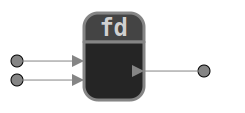

[](/README.md)
[](/README_fr.md)
# Functions diagram

Functions-diagram est un programme Python permettant de représenter graphiquement des fonctions en spécifiant les noms et les types d'entrée et de sortie.  
Son objectif est d'aider les apprenants à faire leurs premiers pas avec les fonctions et à analyser le fonctionnement d'un programme.  
Les éléments (nœuds et fonctions) peuvent être liés et connectés les uns aux autres.   
La représentation graphique peut être exportée au format SVG. 
 
<div style="text-align: center">
    <a href="https://github.com/ebuonocore/functions_diagram">
        
    </a>
</div>


## Sommaire
* [Description](#description)
  * [Un diagramme simple](#un-diagramme-simple)
  * [Association de fonctions](#association-de-fonctions)
  * [Un exemple plus complet](#un-exemple-plus-complet)
* [Format de sauvegarde](#format-de-sauvegarde)
* [Boutons](#boutons)  
  * [Exporter un diagramme en image (.SVG)](readme/export_SVG_fr.md)
  * [Ajouter ou éditer des éléments](readme/add_edit_elements_fr.md)  
  * [Edition des paramètres](readme/settings_fr.md)  
  * [Raccourcis clavier](#raccourcis-clavier)
  * [Contrôle par la souris](#contrôle-par-la-souris) 
* [Auteur](#auteur)
* [Avancement du projet](#avancement-du-projet)
* [Feuille de route](#feuille-de-route)
* [Licence](#licence)

## Description
### Un diagramme simple
  

Ce diagramme représente l'appel d'une fonction <code>xor</code> : 
```{python} 
cipher_text = xor(plain_text, key)
```
Nous pouvons constater que cette fonction prend deux paramètres et renvoie une valeur.  

### Association de fonctions  
Autre exemple impliquant un deuxième appel à la fonction <code>xor</code>.
  
Voici le code correspondant :
```{python} 
cipher_Text = xor(plain_text, key)
deciphered_text = xor(cipher_Text, key)
```

Le même schéma avec les indications de type et le code correspondant.  
  

```{python} 
def xor(a: int, b: int) -> int:
    """
    Return the bitwise operation xor on the two positive integers a and b.

    >>> xor(8, 7)
    15

    >>> xor(7, 3)
    4
    """
    return a ^ b

cipher_Text = xor(plain_text, key)
deciphered_text = xor(cipher_Text, key)
```

Le code et le diagramme sont cohérents avec la signature de la fonction <code>xor</code>.  
```{python} 
>>> import inspect
>>> inspect.signature(xor)
<Signature (a: int, b: int) -> int>
```

### Un exemple plus complet
Nous proposons ici une approche naïve pour résoudre le [problème du voyageur de commerce](https://en.wikipedia.org/wiki/Travelling_salesman_problem).  
Soit une liste de villes :  
```{python} 
cities = ["Paris", "Lyon", "Marseille", ...]
```
Nous devons explorer toutes les combinaisons possibles et trouver l'itinéraire le plus court possible qui visite chaque ville exactement une fois et retourne à la ville d'origine.  

Dans une première approche, on peut imaginer construire un tableau à deux entrées pour connaître le coût d'un itinéraire entre chaque ville.  
  

Chaque cellule peut être remplie en appelant une API (OpenStreetMap, par exemple). Le résultat est implémenté dans un dictionnaire.  

```{python} 
cost = {
    "Paris": {"Paris": 0, "Lyon": 462.941, "Marseille": 772.335, ...},
    "Lyon": {"Paris": 462.941, "Lyon": 0, "Marseille": 312.659, ...},
    "Marseille": {"Paris": 772.335, "Lyon": 312.659, "Marseille": 0, ...},
    ...
}
```
À partir de cette même liste de villes, nous devons générer toutes les combinaisons d'itinéraires possibles rebouclant sur la ville d'origine.  
Par exemple :  
```{python} 
["Paris", "Lyon", "Marseille", ..., "Paris"]
...
["Paris", "Marseille", "Lyon" ..., "Paris"]
```
Maintenant que nous connaissons la table des coûts et tous les itinéraires possibles, il ne nous reste plus qu'à trouver l'itinéraire ayant le coût le plus bas.  
Voici à quoi ressemblerait un schéma global du problème.  

[](readme/TSP_example/assets/TSP_diagram.svg)  
La dernière fonction sera chargée de calculer systématiquement le coût de chaque itinéraire.  
Par la suite, il suffira de pousser plus loin cette approche descendante en spécifiant plus précisément chacune des sous-fonctions.  
Suivez ce lien pour accéder à une [proposition de résolution](/readme/TSP_example/) et les [diagrammes associés](/readme/TSP_example/assets/).  

## Format de sauvegarde
Les diagrammes sont sauvegardés dans un fichier TXT.  
Voici à quoi ressemble la sauvegarde du diagramme précédent.  

```
def create_cost_table(cities:list[str])->dict[str,dict[str,float|None]]
create_cost_table.position(257,236)
create_cost_table.dimension(258,39)

def all_routes(cities:list[str])->list[list[str]]
all_routes.position(291,320)
all_routes.dimension(190,39)

def search_minimum(cost:dict[str,dict[str,float]],permutations_routes:list[list[str]])->tuple[float|None,list[str]]
search_minimum.position(860,349)
search_minimum.dimension(380,58)

node(cost,(620,320))  # fixed
node(permutations_routes,(620,416))
node(cities:list[str],(123,235))

create_cost_table<0---cities
create_cost_table>---cost
all_routes<0---cities
all_routes>---permutations_routes
search_minimum<0---cost
search_minimum<1---permutations_routes
```
Les lignes commençant par <code>def</code> sont utilisées pour créer des blocs de fonctions.
Ils suivent la syntaxe de définition de fonction Python (le <code>':'</code> final est facultatif).
Après chaque ligne <code>def</code>, vous pouvez spécifier les attributs <code>position</code> et/ou <code>dimension</code> du bloc.

Les nœuds sont créés à partir d'une ligne commençant par <code>node</code>. Les paramètres saisis définissent le nom du nœud et ses caractéristiques (indication de type, position).
Le commentaire <code># fixe</code> indique si cet élément ne peut pas être déplacé par placement automatique : **'Auto'**.

A noter que le caractère <code>'*'</code> dans le nom désigne un séparateur : les caractères précédant ce séparateur correspondent au libellé affiché. Cela permet d'avoir des fonctions ou des nœuds avec des étiquettes identiques mais des noms (identifiants) uniques.

Les liens entre les nœuds suivent la syntaxe ci-dessous :  
```
node_name1---node_name2
```

Les nœuds de fonction sont désignés par : ```function_name>``` pour la sortie, et ```function_name<id``` pour les entrées avec <code>id</code> commençant à 0.

## Boutons
 Créer un nouveau fichier  
 Ouvrir un fichier  
 [Sauvegarder un fichier](#format-de-sauvegarde)     
 [Exporter un diagramme en image (.SVG)](readme/export_SVG_fr.md)  
 Déplacer une fonction, un noeud ou un groupe. Permet aussi de déplacer le coin inférieur droit des groupes en mode "Fixed"  
 [Ajouter une fonction](readme/add_edit_elements_fr.md#fonction)  
 [Ajouter un noeud libre](readme/add_edit_elements_fr.md#noeud)   
 [Créer un groupe](readme/add_edit_elements_fr.md#groupe)  
 Relier deux noeuds  
 [Editer un élément (fonction, noeud ou groupe)](readme/add_edit_elements_fr.md)    
 Supprimer un élément (noeud, fonction, groupe ou connexion). Remarque : Pour supprimer tous les éléments d'un groupe, il faut l'éditer.    
 Undo  
 Redo  
 Placer automatiquement les objets sur l'écran  
 [Edition des paramètres](readme/settings_fr.md)     
 Visualiser les informations  

Pour certaines opérations, vous devez d'abord sélectionner une destination. Vous pouvez quitter ce mode en cliquant avec le bouton droit de la souris ou en appuyant sur *Enter* ou *Esc*.

## Raccourcis clavier
  + **CTRL + s** : Sauvegarder
  + **CTRL + c** : Copier/coller
  + **CTRL + z** & **CTRL + y** : Annuler & Refaire
  + **CTRL + a** : Création d'un groupe qui englobe tous les éléments du diagramme
  + **CTRL + q** & **CTRL + w** : Zoom + et Zoom -
  + **CTRL + o** : Retour au zoom et au décalage d'origine

## Contrôle par la souris
  + **Molette** : Zoom + et Zoom -
  + **Clic + Déplacement** : Décalage du point de référence du dessin

## Auteur
Eric Buonocore

## Avancement du projet
Le programme est opérationnel.
- [x] Ajouter des éléments (nœuds, fonctions)
- [x] Interconnecter des éléments
- [x] Ouvrir et sauvegarder un diagramme
- [x] Déplacer et modifier des éléments
- [x] Undo/Redo
- [x] Positionner automatiquement des éléments
- [x] Paramétrer le programme et appeler l'aide
- [x] Multiselection d'éléments pour les déplacements et les suppressions  
- [x] Définir l'espacement des éléments pour le placement automatique  
- [x] Permettre de justifier les noms des nœuds libres  
- [x] Permettre l'agrandissement et le déplacement de l'ensemble de la mise en page

## Feuille de route
- [ ] Tester et régler les bogs

## Licence


