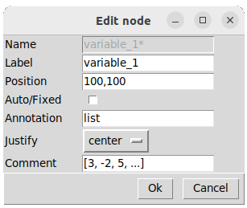
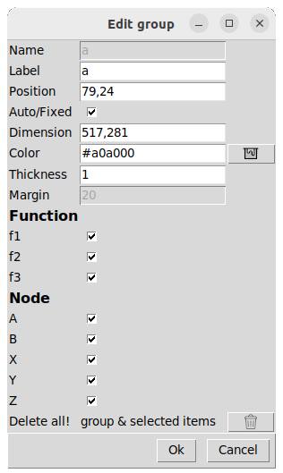

## [Functions diagram](../README.md)
# Add or edit elements

You can create nodes, functions or groups.

Or you can edit the settings of an existing element by clicking on the pen button, and then select the element you want to modify.  
 

# Function
 

  

    
  

    

    <ul>
      <li><b>Name:</b> An id for each function block.</li>
      <li><b>Label:</b> The label displayed on the diagram. Different functions can have the same label.</li>
      <li><b>Position:</b> x: int, y: int.</li>
      <li><b>Auto/Fixed:</b> If the position is fixed, the function cannot be moved by automatic positioning (Auto).</li>
      <li><b>Dimension:</b> width: int, height: int.</li>
      <li><b>Output:</b> The type of the output.</li>
      <li><b>Hide/Show output:</b> Selected by default to display the function output. Deselected if it is a procedure.</li>
      <li><b>Header color:</b> A specific name of mcolors.CSS4_COLORS key or a rgb format.</li>
      <li><b>Parameters:</b> Parameter name and type. Click 'plus' to add entries.</b> </li>
    </ul>  
  

Result: 

# Node
 

  

    
  

    

    <ul>
      <li><b>Name:</b> An id for each node.</li>
      <li><b>Label:</b> The label displayed on the diagram.</li>
      <li><b>Position:</b> x: int, y: int.</li>
      <li><b>Auto/Fixed:</b> If the position is fixed, the node cannot be moved by automatic positioning (Auto).</li>
      <li><b>Annotation:</b> The type of the node.</li>
    </ul>  
  

Result: 

# Group

 

  

    
  

    

    <ul>
      <li><b>Name:</b> A unique identifier for each node.</li>
      <li><b>Label:</b> The label displayed on the chart.</li>
      <li><b>Position:</b> x: int, y: int. Disabled in "Auto" mode </li>
      <li><b>Auto/Fixed:</b> In "Fixed" mode (default), the user imposes the coordinates of the group.  In "Auto" mode, the rectangle of the group will automatically follow the elements it contains if they are moved. This mode thus makes it possible to group elements (functions, nodes) in order to move them or delete. </li>
      <li><b>Dimension:</b> x: int, y: int. Disabled in "Auto" mode </li>
      <li><b>Color:</b> Color of the plot and the title in mcolors.CSS4_COLORS format or in RGB.</li>
      <li><b>Thickness:</b> Line Thickness</li>
      <li><b>Margin:</b> Margin in pixels to frame the elements of the group. Disabled in "Fixed" mode.</li>
      <li><b>Function:</b> List of functions to select/deselect.</li>
      <li><b>Node:</b> List of nodes to select/deselect.</li>
      <li><b>Delete all! :</b> Allows you to remove the group and all selected items from the lists of functions and nodes.</li>
    </ul>  
  

## Group uses
* <u>Move:</u>Allows you to move a set of elements.
* <u>Duplication:</u>Copying elements with **CTRL + c** also works with groups. This allows you to duplicate several elements simultaneously with their links.
* <u>Group Edit:</u>Allows you to modify the positioning of all items in a group by setting **All items** to **Auto** or **Fixed**
* <u>Deleting elements:</u>The deletion tool (eraser) only destroys the group, not the elements it contains. **Delete all! :** Allows you to delete the selected elements in the group list.

**Note :**
**CTRL + a** Create a group including all diagram elements.

