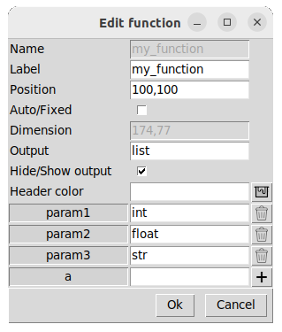

## [Functions diagram](../README.md)
# Add or edit elements

You can create nodes or functions.  

Or you can edit the settings of an existing element by clicking on the pen button, and then select the element you want to modify.  
 

# Function
 

  

    
  

    

    <ul>
      <li><b>Name:</b> An id for each function block.</li>
      <li><b>Label:</b> The label displayed on the diagram. Different functions can have the same label.</li>
      <li><b>Position:</b> x: int, y: int.</li>
      <li><b>Auto/Fixed:</b> If the position is fixed, the function cannot be moved by automatic positioning (Auto).</li>
      <li><b>Dimension:</b> width: int, height: int.</li>
      <li><b>Output:</b> The type of the output.</li>
      <li><b>Hide/Show output:</b> Selected by default to display the function output. Deselected if it is a procedure.</li>
      <li><b>Header color:</b> A specific name of mcolors.CSS4_COLORS key or a rgb format.</li>
      <li><b>Parameters:</b> Parameter name and type. Click 'plus' to add entries.</b> </li>
    </ul>  
  

Result: 

# Node
 

  

    
  

    

    <ul>
      <li><b>Name:</b> An id for each node.</li>
      <li><b>Label:</b> The label displayed on the diagram.</li>
      <li><b>Position:</b> x: int, y: int.</li>
      <li><b>Auto/Fixed:</b> If the position is fixed, the node cannot be moved by automatic positioning (Auto).</li>
      <li><b>Annotation:</b> The type of the node.</li>
    </ul>  
  

Result: 

