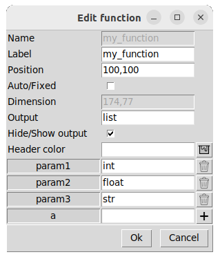
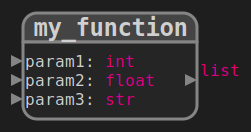
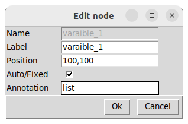
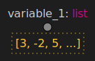
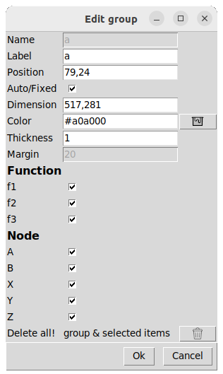

## [Functions diagram](../README_fr.md)
# Ajouter ou créer des éléments

Vous pouvez créer des noeuds, des fonctions ou des groupes.  

Ou vous pouvez éditer les paramètres d'un élément existant en cliquant le bouton en forme de crayon, et sélectionner l'élément à modifier.  
 

# Fonction
 

  

    
  

    

    <ul>
      <li><b>Name :</b> Un identifiant unique pour chaque bloc de fonction.</li>
      <li><b>Label :</b> Le label affiché sur le diagramme. Différentes fonctions peuvent avoir le même label.</li>
      <li><b>Position :</b> x: int, y: int.</li>
      <li><b>Auto/Fixed :</b> Si la position est fixe, la fonction ne peut pas être déplacée par positionnement automatique (Auto).</li>
      <li><b>Dimension :</b> largeur: int, hauteur: int.</li>
      <li><b>Output :</b> Le type de la sortie.</li>
      <li><b>Hide/Show output :</b> Par défaut la sortie de la fonction est affichée. Déselectionnez si c'est une procédure.</li>
      <li><b>Header color :</b> Une couleur au format mcolors.CSS4_COLORS ou a RVB.</li>
      <li><b>Parameters :</b> Nom et type des paramètres. Cliquez sur 'plus' pour ajouter des entrées.</b> </li>
    </ul>  
  

Resultat : 

# Noeud
 

  

    
  

    

    <ul>
      <li><b>Name :</b> Un identifiant unique pour chaque noeud.</li>
      <li><b>Label :</b> Le label affiché sur le diagramme.</li>
      <li><b>Position :</b> x: int, y: int.</li>
      <li><b>Auto/Fixed :</b> Si la position est fixe, la fonction ne peut pas être déplacée par positionnement automatique (Auto).</li>
      <li><b>Annotation :</b> Le type du noeud.</li>
    </ul>  
  

Resultat: 

# Groupe

 

  

    
  

    

    <ul>
      <li><b>Name :</b> Un identifiant unique pour chaque noeud.</li>
      <li><b>Label :</b> Le label affiché sur le diagramme.</li>
      <li><b>Position :</b> x: int, y: int. Désactivé en mode "Auto" </li>
      <li><b>Auto/Fixed :</b> En mode "Fixed" (par défaut), c'est l'utilisateur qui impose les coordonnées du groupe.  En mode "Auto" par contre, le rectangle du groupe suivra automatiquement les éléments qu'il content s'ils sont déplacés. Ce mode permet ainsi de regrouper des éléments (fonctions, noeuds) pour les déplacer ou les supprimer. </li>
      <li><b>Dimension :</b> x: int, y: int. Désactivé en mode "Auto" </li>
      <li><b>Color :</b> Couleur du tracé et du titre au format mcolors.CSS4_COLORS ou a RVB.</li>
      <li><b>Thickness :</b> Epaisseur du traitli>
      <li><b>Margin :</b> Marge en pixels pour encadrer les éléments du groupe. Désactivé en mode "Fixed".</li>
      <li><b>Function :</b> Liste des fonctions à sélectionner/désélectionner.</li>
      <li><b>Node :</b> Liste des noeuds à sélectionner/désélectionner.</li>
      <li><b>Delete all! :</b> Permet de supprimer le groupe et tous les éléments sélectionnes des listes de fonctions et de noeuds.</li>
    </ul>  
  

## Utilités des groupes
* <u>Déplacement :</u> Permet de déplacer un ensemble d'éléments.  
* <u>Duplication :</u>  La copir d'élément avec **CTRL + c** fonctionne aussi avec les groupes. Ce qui permet de dupliquer plusieurs éléments simultannément avec leurs liens.  
* <u>Edition groupée :</u>  Permet de modifier le positionnement de tous les éléments d'un groupe en réglant **All items** sur **Auto** ou **Fixed** 
* <u>Suppession d'éléments :</u>  L'outil de suppression (gomme) ne détruit que le groupe, pas les éléments qu'il contient. b>Delete all! :</b> Permet de supprimer les éléments sélectionnés dans la liste du groupe.

::: details Remarque
**CTRL + a** permet de créer un groupe qui englobe tous les éléments du diagramme.
:::

