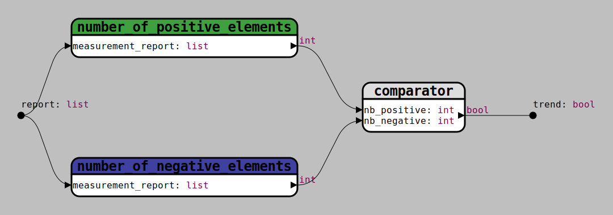

## [Functions diagram](../README.md)
# Export diagram to SVG

 

  

    
  

    

    <ul>
      <li>**Margin:** Adds pixels to all four sides.</li>
      <li>**Opacity:** Regulates the opacity of the background. Ranges from 0 for a transparent background to 1 for an opaque background.</li>
    </ul>  
  

Examples: A diagram exported with a #808080 background color.  
Margin: 0 / Opacity: 0

The same image with Margin: 20 / Opacity: 0.5

