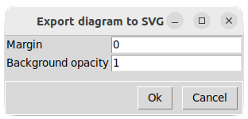
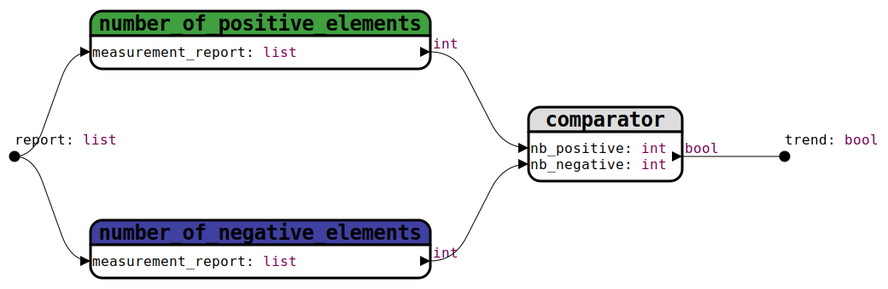

## [Functions diagram](../README_fr.md)
# Exporter un diagramme au format SVG

 

  

    
  

    

    <ul>
      <li><b>Margin :</b> Ajouter des pixels à chacun des quatre côté.</li>
      <li><b>Opacity :</b> Régler l'opacité du fond de l'image. De 0, pour une transparence totale, à 1 pour un fond opaque.</li>
    </ul>  
  

Exemples: Un diagramme exportéavec une couleur de fond à #808080.  
Margin: 0 / Opacity: 0

La même image avec les paramètres : Margin: 20 / Opacity: 0.5

