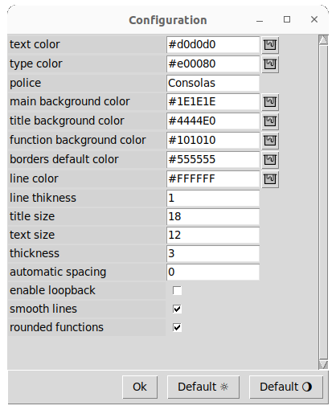
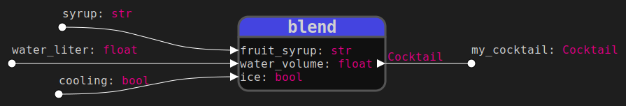

## [Functions diagram](../README.md)
# Settings

This window is used to configure the graphics and operation of the program. 

 

  

    
  

    

    <ul>
      <li><b>main background color:</b> Main window background color/li>
      <li><b>police:</b> general typeface</li>
      <li><b>title background color:</b> DDefault function name background color. Can be set locally for each function</li>
      <li><b>title size:</b> Size of the function names</li>
      <li><b>text color:</b> Colour of function names and nodes</li>
      <li><b>text size:</b> Size of the other elements (Node names and type hints)</li>
      <li><b>type color:</b> Type hint colour</li>
      <li><b>function background color:</b> Background color of the lower part of the function block</li>
      <li><b>borders default color:</b> Default feature border color</li>
      <li><b>border thickness:</b> Function borders thikness</li>
      <li><b>line color:</b> Color of the links between nodes</li>
      <li><b>line thikness:</b> Thikness of the links</li>
      <li><b>automatic spacing:</b> Spacing between each function during automatic placement. Default to 0, sets the maximum spacing to fill the window</li>
      <li><b>enable loopback:</b> Disabled by default, prohibits the possibility of looping an output on these antecedents. If enabled, automatic placement is inhibited.</li>
      <li><b>smooth lines:</b>Only horizontal and vertical links if disabled, otherwise curved links</li>
      <li><b>rounded functions:</b> Square or rounded edges of features</li>
      <li><b>default buttons:</b> Default settings for light or dark mood. Stored in <code>preferences_default_light.json</code> and <code>preferences_default_dark.json</code></li> files
    </ul>  
  

Affichage d'une fonction avec les paramètres ci-dessus :

