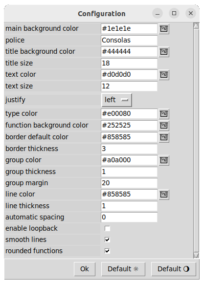

## [Functions diagram](../README_fr.md)
# Paramètres

Cette fenêtre permet de configurer le graphisme et le fonctionnement du programme.

 

  

    
  

    

    <ul>
      <li><b>text color :</b> Couleur des noms de fonctions et des noeuds</li>
      <li><b>type color :</b> Couleur des annotations de types</li>
      <li><b>police :</b> Police d'écriture générale</li>
      <li><b>main background color :</b>  Couleur de fond de la fenêtre principale</li>
      <li><b>title background color :</b> Couleur de fond des noms de fonctions par défaut. Peux être paramétrée localement pour chaque fonction</li>
      <li><b>function background color :</b> Couleur de fond de la partie inférieur du bloc de fonction</li>
      <li><b>borders default color :</b> Couleur par défaut des bords des fonctions</li>
      <li><b>line color :</b> Couleur des liens entre noeuds</li>
      <li><b>line thikness :</b> Epaisseur des liens</li>
      <li><b>title size :</b> Taille des noms de fonctions</li>
      <li><b>text size :</b> Taille des autres écritures (Noms des noeuds et types)</li>
      <li><b>thickness :</b> Epaisseur des bordures de fonctions</li>
      <li><b>automatic spacing :</b> Ecartement entre chaque fonction lors d'un placement automatique. Par défaut à 0, règle l'espacement maximum pour remplir la fenêtre</li>
      <li><b>enable loopback :</b> Désactivé par défaut, interdit la possibilité de faire reboucler une sortie sir ces antécédents. Si c'est activé, le placement automatique est inhibé.</li>
      <li><b>smooth lines :</b> Liens uniquement horizontaux et verticaux si désactivé, sinon liens courbes</li>
      <li><b>rounded functions :</b> Bords carrés ou arrondis des fonctions</li>
      <li><b>default buttons :</b> Paramétrages par défaut pour l'ambiance lumineuse ou sombre. Enregistrés dans les fichiers <code>preferences_default_light.json</code> et <code>preferences_default_dark.json</code></li>
    </ul>  
  

Display of a function with the above parameters:

